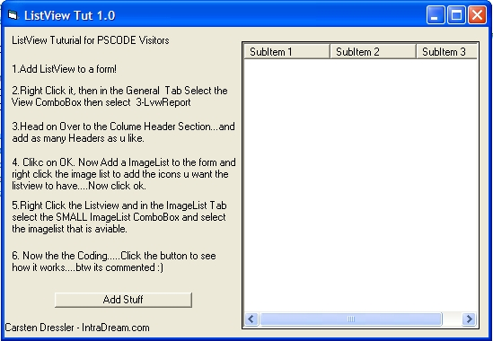



## Listview Tuturial

### Description

This is a example/Tuturial on how to use the Listview....This will show you how to add text, Subitems, and icons to your listview. I made this simple prog for a friend and he told me to upload it on pscode.com dont worry about voting for this code unless u feel that it is nesscary. Carsten D. - www.intradream.com
 
### More Info
 

             |
---                |---
**Submitted On**   |2002-11-17 18:56:34
**By**             |[Carsten Dressler](https://github.com/Planet-Source-Code/PSCIndex/blob/master/ByAuthor/carsten-dressler.md)
**Level**          |Advanced
**User Rating**    |5.0 (25 globes from 5 users)
**Compatibility**  |VB 5\.0, VB 6\.0
**Category**       |[Coding Standards](https://github.com/Planet-Source-Code/PSCIndex/blob/master/ByCategory/coding-standards__1-43.md)
**World**          |[Visual Basic](https://github.com/Planet-Source-Code/PSCIndex/blob/master/ByWorld/visual-basic.md)
**Archive File**   |[Listview\_T14993511172002\.zip](https://github.com/Planet-Source-Code/carsten-dressler-listview-tuturial__1-40829/archive/master.zip)

